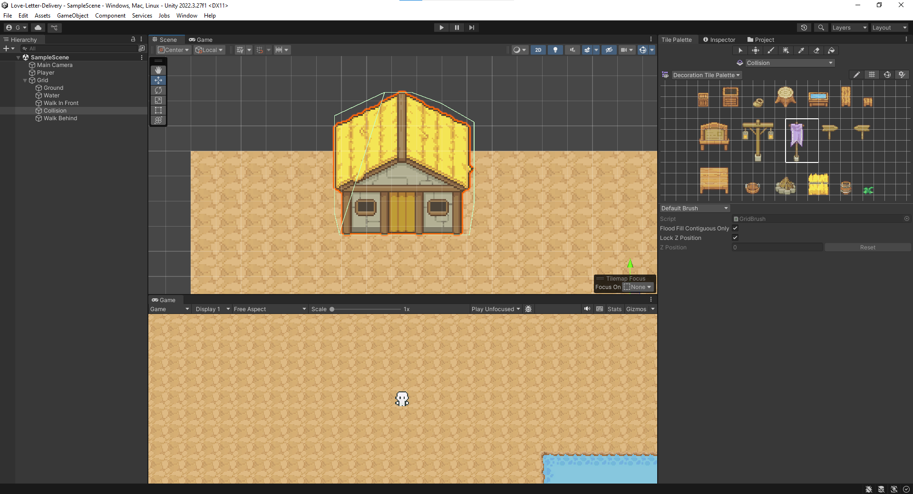
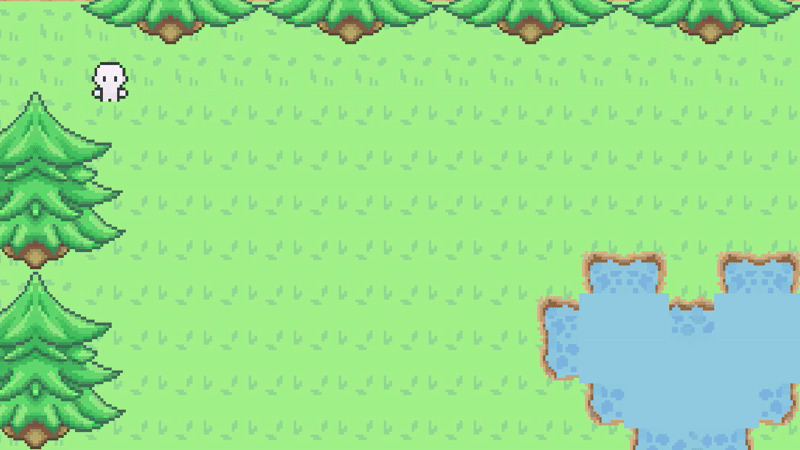
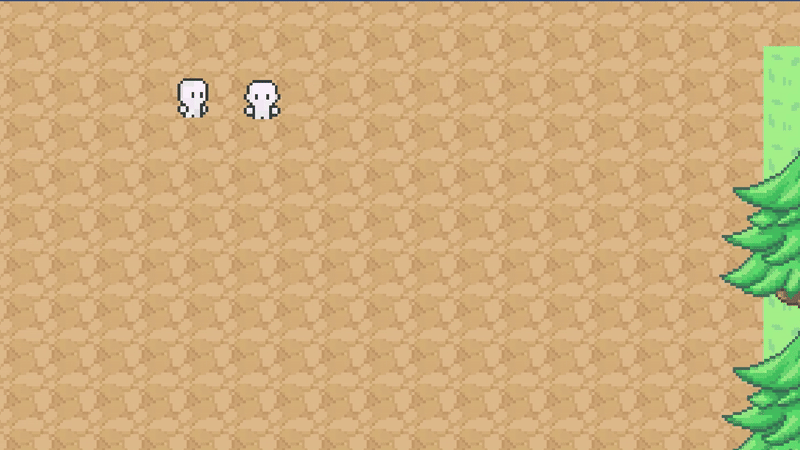
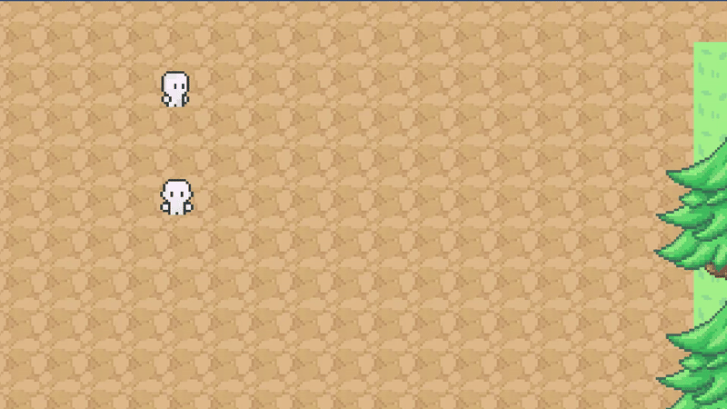
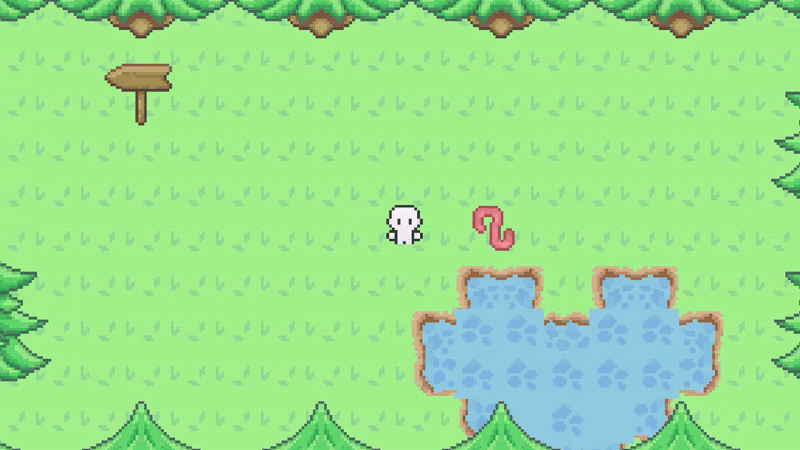

# Love Letter Delivery (Placeholder Name)
A 2D top-down adventure game with a fun little story relating to Valentine's Day!

## Status
Currently a WIP!

## Assets
* [Fantasy Tileset](https://ventilatore.itch.io/the-fantasy-tileset)
* [RPG Icons - Edited](https://butterymilk.itch.io/tiny-wonder-rpg-icons)
* [Prototype Character Sprites](https://otterisk.itch.io/hana-caraka-base-character)

## Scope
This project is designed for me to be able to complete by Valentine's Day. Because of this time constraint, the game's mechanics will be relatively simple, and the story will be short and sweet.

## Dev Log

### Day 1: February 1, 2025
* Project Setup: The Unity UI is intimidating at first, but I had a tiny bit of experience navigating around it.
* Asset Creation: I created my first ever asset with two frames to create a simple animation. This was my first ever 16x16 asset that I've created, and it was honestly a fun and rewarding experience.
* Importing Assets: I imported the asset I created and the free assets I found on the internet.

### Day 2: February 2, 2025
* Tile Palettes: I had a busy day today, but I created and organized tile palettes with the assets I imported.

### Day 3: February 3, 2025
* Player Movement: Again, this was not a productive day because I had a math quiz to study for, but I implemented a simple player movement script. All it does right now is let the player control a sprite with WASD. There are no animations, so it just moves around in a very smooth way.

### Day 4: February 4, 2025
* Collisions: I added simple collisions, preventing the player from clipping with objects. I just used components to achieve this, and I plan to fine-tune it because at the moment, the collision areas around the objects are not as accurate as I would like.
* Tile Map: I started the ground layer for the map, experimenting with other layers, including collision and walking behind/in front.

### Day 5: February 5, 2025
* Tile Map: I continued building the tile map (which is probably my least favourite task). I currently have two zones for the overall map: a forest and town.
* Camera Following: I added a simple camera that follows the player as they move, making sure to not go "out of bounds" of the map. Thus, the empty parts of the grid are never shown.
* Map Transitions: To make these zones more prominent, I added different boundaries and added a transition for the player when they move from one section to another.

### Day 6: February 6, 2025
* Dialogue System: I added a (very) simple dialogue system. This was accomplished with a Dialogue Panel GameObject with a Text component. A simple script allows an NPC to be talked to if the player is close enough (using collisions). The NPC currently has a fixed set of dialogue that resets when the player stops speaking to them.

### Day 7: February 7, 2025
* Interaction Icon: I added a simple interaction icon that pops up once the player gets close to an interactable GameObject (in this case, an NPC). However, at the moment, it also pops up once the player triggers the map transition because that collider also uses isTrigger. I need to fix this by adding an interface for interactable items to separate them from other colliders (ex. Map transitions). I should also add a check in the InteractionDetector class.

### Day 8: February 8, 2025
* Expanded Tile Map: I continued working on the task I like the LEAST... which was expanding the tilemap. I created the basic map which is pretty small, and I started to populate it with decorations and buildings. To be fair, the free asset pack I'm using doesn't have many variations, so I might have to scale the map down even more so I can still make the map look interesting while still using the free assets I found.
* NPC Idle Animation: I added a simple two animation for the worm NPC that loops through two different sprites to create an idle animation. I did this without creating a script and used Unity's built-in animator. I added this animator to the worm NPC, making sure the animation loops.
