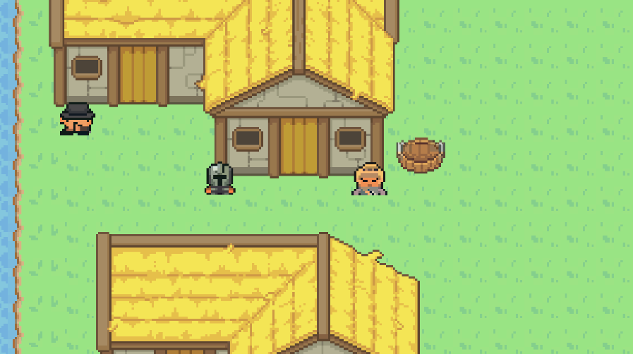
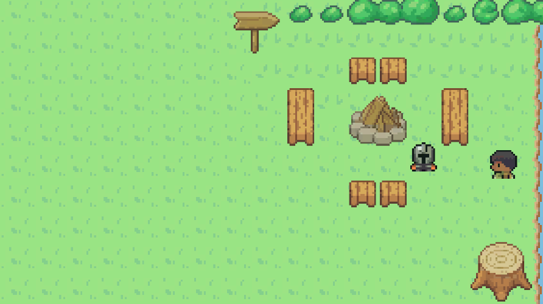
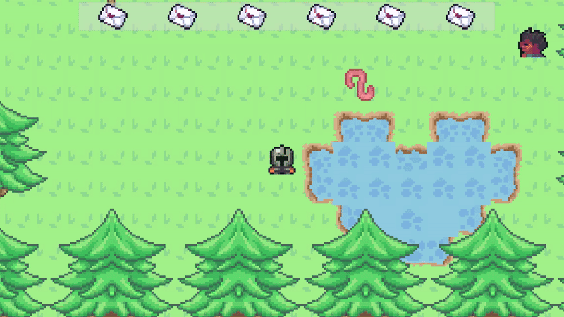
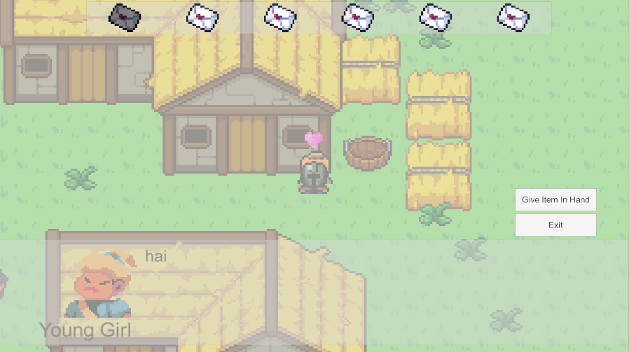

# Love Letter Delivery (Placeholder Name)
A 2D top-down adventure game with a fun little story relating to Valentine's Day!

## Status
Currently a WIP!

## Assets
* [Fantasy Tileset](https://ventilatore.itch.io/the-fantasy-tileset)
* [RPG Icons - Edited](https://butterymilk.itch.io/tiny-wonder-rpg-icons)
* [Player and NPC Character Sprites](https://pixel-boy.itch.io/ninja-adventure-asset-pack)
* [Prototype Character Sprites](https://otterisk.itch.io/hana-caraka-base-character)

## Scope
This project is designed for me to be able to complete by Valentine's Day. Because of this time constraint, the game's mechanics will be relatively simple, and the story will be short and sweet.

## Dev Log

### Day 1: February 1, 2025
* Project Setup: The Unity UI is intimidating at first, but I had a tiny bit of experience navigating around it.
* Asset Creation: I created my first ever asset with two frames to create a simple animation. This was my first ever 16x16 asset that I've created, and it was honestly a fun and rewarding experience.
* Importing Assets: I imported the asset I created and the free assets I found on the internet.

### Day 2: February 2, 2025
* Tile Palettes: I had a busy day today, but I created and organized tile palettes with the assets I imported.

### Day 3: February 3, 2025
* Player Movement: Again, this was not a productive day because I had a math quiz to study for, but I implemented a simple player movement script. All it does right now is let the player control a sprite with WASD. There are no animations, so it just moves around in a very smooth way.

### Day 4: February 4, 2025
* Collisions: I added simple collisions, preventing the player from clipping with objects. I just used components to achieve this, and I plan to fine-tune it because at the moment, the collision areas around the objects are not as accurate as I would like.
* Tile Map: I started the ground layer for the map, experimenting with other layers, including collision and walking behind/in front.

### Day 5: February 5, 2025
* Tile Map: I continued building the tile map (which is probably my least favourite task). I currently have two zones for the overall map: a forest and town.
* Camera Following: I added a simple camera that follows the player as they move, making sure to not go "out of bounds" of the map. Thus, the empty parts of the grid are never shown.
* Map Transitions: To make these zones more prominent, I added different boundaries and added a transition for the player when they move from one section to another.

### Day 6: February 6, 2025
* Dialogue System: I added a (very) simple dialogue system. This was accomplished with a Dialogue Panel GameObject with a Text component. A simple script allows an NPC to be talked to if the player is close enough (using collisions). The NPC currently has a fixed set of dialogue that resets when the player stops speaking to them.

### Day 7: February 7, 2025
* Interaction Icon: I added a simple interaction icon that pops up once the player gets close to an interactable GameObject (in this case, an NPC). However, at the moment, it also pops up once the player triggers the map transition because that collider also uses isTrigger. I need to fix this by adding an interface for interactable items to separate them from other colliders (ex. Map transitions). I should also add a check in the InteractionDetector class.

### Day 8: February 8, 2025
* Expanded Tile Map: I continued working on the task I like the LEAST... which was expanding the tilemap. I created the basic map which is pretty small, and I started to populate it with decorations and buildings. To be fair, the free asset pack I'm using doesn't have many variations, so I might have to scale the map down even more so I can still make the map look interesting while still using the free assets I found.
* NPC Idle Animation: I added a simple two animation for the worm NPC that loops through two different sprites to create an idle animation. I did this without creating a script and used Unity's built-in animator. I added this animator to the worm NPC, making sure the animation loops.

### Day 9: February 9, 2025
* Asset Swap: Previously, I was using a prototype character for the player and NPCs, but I replaced it with a free asset pack I found online that had a great variety of characters! I added more NPCs and gave them some default dialogue that I plan to adjust later when I implement the letter system.

### Day 10: February 10, 2025
* Dialogue Planning: I didn't feel like coding today, so I decided to work on this project in a slightly different way. I will be writing out each of the NPCs' dialogue with choices and branching. I'll also figure out the whole letter system, so I can make it easier for me to code later on. I still count this as me making progress of some kind because I needed to plan out the dialogue and branches, so I could implement it into code. I will likely refactor the dialogue logic to accommodate the addition of choices. Wish me luck please. I am going to need it.

### Day 11: February 11, 2025
* Inventory Hotbar: I implemented a simple hotbar system that lets the player cycle through the letters in the inventory, highlighting the selected one. I accomplished this by creating a simple UI panel for the hotbar. I created a HotbarManager script that sets the slots of the hotbar and also handles the input of the user (pressing numbers 1-6).

### Day 12: February 12, 2025
* Dialogue Buttons: I'm on the final stretch of this project, and I think I might just make it in time. I created a Choice Panel in the same canvas the Dialogue Panels, and I added two buttons to the Choice Panel - `give item` and `exit`. The `give item` button "gives" the NPC the letter the player is holding then exits the conversation. The `exit` button does as you would expect.

### Day 13: February 13, 2025
* Letter Delivery System: I implemented the letter delivery system using a Letter class that contains an NPC name and the hint of the letter. In the HotbarManager, I randomized the order of the letters, so it's different every time - I used a simple shuffling algorithm that I found on Wikipedia. Next, I made it so that if the player presses on the `give item` button, it checks if the NPC has already been given a letter or is an NPC that does not take letters. I used a Score class to keep track of the number of deliveries and the score of correct letter matching. Once the final letter is delivered, the game ends. All I need to complete now is adding walking animations for the player, create an end game UI, and populate the NPCs' dialogues with the ones I've preapred in a separate document.

### Day 14: February 14, 2025
* End Game UI: I decided to keep it simple with the End Game UI. All it does is display whether the player won or lost in addition to the number of letters correctly delivered.
* NPC Dialogue: I finally finished putting in all the NPCs dialogues.

### Conclusion
With the 2 weeks coming to an end, I have a lot to reflect on. This experience was both challenging yet rewarding at the same time. I was completely new to game development at the beginning, and while I'm still fresh to this, I at least know how to do something small. This was a great way for me to dip my toes into C#. I actually was learning as I worked on this project, and it stuck with me because I wasn't just creating silly little programs to try and learn. I applied my knowledge to something I wanted to make. Also, the challenge was not C# but it was Unity. This was challenging, and I'd be lying if I said I wasn't excited to take a break from this. I'll definitely come back to this project in the future - refactor code, add more features, polish it up. For now, I created a prototype that I'm pretty content with.